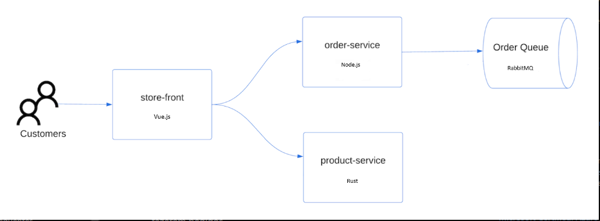

# k8s-microsoft-demo
## Objetivo do projeto

Este projeto tem como objetivo explorar e demonstrar o uso de Kubernetes para gerenciar e orquestrar aplicações containerizadas. Através deste estudo, serão abordados os seguintes pontos principais:

* Deploy e gerenciamento de containers: Entendimento dos processos de deploy, escalabilidade e atualizações contínuas de aplicações utilizando Kubernetes.

* Configuração de clusters: Implementação e configuração de clusters de Kubernetes, incluindo a distribuição de workloads em múltiplos nós.

* Aplicações resilientes e escaláveis: Desenvolvimento de aplicações que possam escalar de forma eficiente e lidar com falhas em um ambiente de produção em Kubernetes.

O objetivo é obter um entendimento completo sobre como o Kubernetes pode ser usado para suportar aplicações complexas em ambientes de produção, focando na automação, escalabilidade, segurança e alta disponibilidade.

Acesse [aqui](https://github.com/Azure-Samples) o repositório oficial Azure-Samples.

## Arquitetura do Projeto



## Descrição do projeto

A aplicação de exemplo deste repositório é um aplicativo store-front básico, incluindo as seguintes implantações e serviços do Kubernetes:

* Frontend: Aplicativo Web para visualização de produtos e realização de pedidos
* Serviço do produto: Exibe informações do produto
* Serviço de pedido: Realiza pedidos
* Rabbit MQ: Fila de mensageria dos pedidos.

## Automação do projeto

Para este estudo, utilizaremos algumas tecnologias que simulam um ambiente de produção executado de forma local.

Para subir o cluster com os nodes, instalar o metallb e o ingress controller, executar o comando:

```
make up
```

> **Nota**: Após a execução do comando acima, o ambiente será configurado conforme instruções contidas no arquivo _Makefile_. Isso levará alguns minutos para que o ambiente fique completamente disponível.

> [!IMPORTANT]
> O range de endereços IPs alocados para o metallb contidos no arquivo metallb-pool.yaml foi setado de acordo com o endereço IP da docker network do ambiente local. Importante checar essa configuração de acordo com o seu ambiente.

Para alterar o endereço IP default deste projeto, você pode executar o seguinte comando:

```
docker inspect kind | jq -r '.[].IPAM.Config[0].Subnet'
```

Após obter a saida do comando acima com endereço IP, alterar o arquivo metallb-pool.yaml com a quantidade de IPs desejados. 

## Tecnologias utilizadas no projeto

* Kind
* Makefile
* Metallb
* Nginx Ingress
* .NET Core
* RabbitMq
* Docker
* Kubernetes